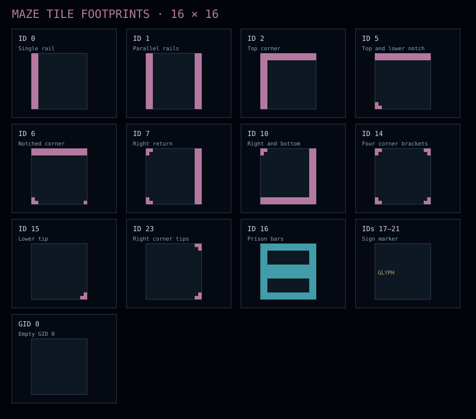
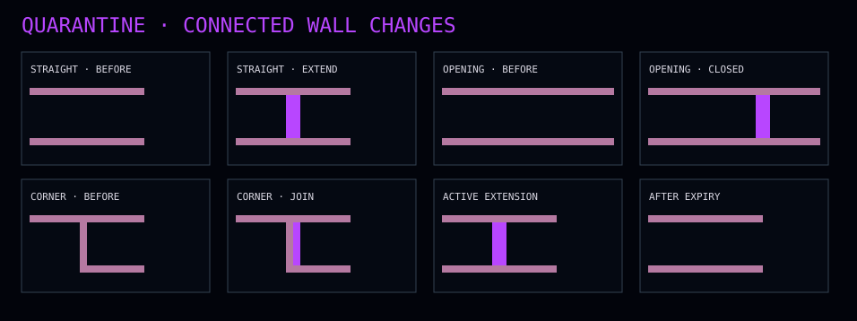

# Maze variants and wall tiles

Both playable maps use a 16 × 16 pixel Tiled grid. The default run loads `public/assets/mazes/default/maze.json`; `VITE_GAME_ENV=DEMO` selects `public/assets/mazes/default/demo.json`. Guided practice always uses the demo map. The original Tiled GID `0` means no tile; local ID `0` means the first actual wall tile.

| Variant | Authored JSON grid | Runtime grid | Packet spawn | Prison tiles | Empty GID 0 cells |
| --- | --- | --- | --- | --- | --- |
| Default | 51 × 51 | 49 × 49 after trimming the one-tile empty border | `(24,25)` after trim | Seven local-ID-16 tiles, `x=21…27, y=26` after trim | 200 in source, none after trim |
| Demo/tutorial | 13 × 13 | 13 × 13 | Inferred `(6,7)`; each tutorial lesson can override it | Five local-ID-16 tiles, `x=4…8, y=8` | None |

The default JSON includes explicit Packet and enemy-home objects. The demo map has no spawn object layer: `EnemyJailLayout` infers the prison run and places the Packet immediately above it. The map parser reads the `Maze` tile layer, trims the occupied bounds, rebases object positions, rotates/flips each tile’s collision flags, infers linked portals from open map edges, and blocks accidental exits into void. Portal objects in the default JSON describe the authored mouths; runtime portal pairing comes from edge inference. The default and demo maps each include a five-tile PACKETLOSS sign run.

Edit the demo layout in `public/assets/mazes/default/demo.tmx` and shared collision definitions in `public/assets/mazes/tileset.tsx`, then run `pnpm map:demo:convert` to regenerate `demo.json`. The default maze is authored in its JSON file. The table below counts local IDs in the two JSON `Maze` layers as checked on 2026-09-19; tile transforms do not change the ID counts.

## Tile atlas

In the atlas, each colored square is one solid footprint pixel. Pink marks ordinary maze walls, cyan marks the prison’s top face, and the gold sign card is schematic: the actual five-tile lettering is generated separately. The SVG is generated from `TILE_FOOTPRINTS` in `src/game/domain/world/MazeFootprint.ts` by `node scripts/generate-maze-atlas.mjs`; the four-pixel Quarantine rail examples below use the same footprint builder. `#` corresponds to solid pixels in the source arrays and `.` to open pixels.

| Local ID | Unrotated silhouette | Blocked movement directions | Default count | Demo count |
| --- | --- | --- | ---: | ---: |
| 0 | Two-pixel left rail | Left | 184 | 40 |
| 1 | Two-pixel left and right rails | Left, right | 1,381 | 60 |
| 2 | Top rail joining a left rail | Up, left | 0 | 1 |
| 5 | Top rail with a small lower-left notch | Up | 0 | 3 |
| 6 | Top rail with a lower corner detail | Up | 0 | 0 |
| 7 | Right rail with top and bottom returns | Right | 428 | 21 |
| 10 | Right rail joining a full bottom rail | Right, down | 328 | 22 |
| 14 | Four small corner brackets around a floor center | None | 60 | 4 |
| 15 | Small lower-right tip | None | 4 | 4 |
| 23 | Upper-right and lower-right corner tips | None | 4 | 4 |
| 16 | Prison bars with two rectangular openings | All four in tile metadata; jail release has a separate pass-through rule | 7 | 5 |
| 17–21 | Five sign markers, rendered together as PACKETLOSS lettering | All four | 1 of each | 1 of each |
| GID 0 | Void, with no floor or wall mesh | Boundary-blocking | 200 before trim | 0 |

ID 6 is defined in the shared Tiled tileset and supported by the renderer but currently unused in either map. IDs 2 and 5 appear only in the demo. IDs 14, 15, and 23 have visible border details but no blocked movement directions. The visual footprint and directional collision metadata are separate rules: `collides` alone does not prevent leaving a tile; movement checks the relevant side on both the current and adjacent tile. Prison release is an explicit exception for enemies leaving the pen.

Tiled stores a GID with horizontal, vertical, and diagonal flip bits. The parser strips those flags, subtracts the tileset’s `firstgid` to obtain the local ID, and resolves them into rotation and flip. The same transformation is applied to directional collision and the 16 × 16 visual silhouette. For example, rotating local ID 0 by 90° makes its left rail a top rail and rotates its blocked direction to Up. The floor remains one flat plane per nonempty map tile, regardless of the wall silhouette above it.

## Rendering and joins

`MazeFootprint` rasterizes every transformed wall tile into one continuous pixel grid. The wall layer excludes ID 16 (prison) and IDs 17–21 (sign). Boundary tracing removes internal tile seams and keeps separate contours around holes and diagonal-only contacts. The filled contours become square-sided geometry extruded to **12 world units**; the exposed boundaries become **0.35-unit** box-strip outlines along the wall base, top, and vertical corners. Wall faces use dark `#1e0d20` with muted pink `#b579a1` outlines. The camera’s fixed tilt reveals the sides without changing corridor alignment.

The prison uses its own exact ID-16 footprint, including the two openings, and keeps the original top-face area. Its group is compressed to **0.2 world units** tall and moved upward so its top sits at `y=12`, level with maze walls. Prison faces are dark blue `#061428` with cyan `#419da9` outlines. Where the prison meets a maze wall, the touching pink segments are omitted; the prison’s outside contour is omitted while its internal bar outlines remain. Sign tiles form runs of dark gold extruded lettering with gold `#b9a36b` outlines. The map floor sits just below `y=0`.

## Quarantine extensions

Quarantine closes an **open connection between adjacent tiles**, stored once as the left/top tile plus a `right` or `down` side. The shared collision overlay marks both sides of that connection closed. Other exits in either tile remain usable. A candidate must join permanent wall pixels at a two-pixel end cap, leave the center visually open before construction, and pass collision and actor-clearance checks on both adjacent tiles. This permits straight continuations and corner joins while excluding floating, diagonal-only, duplicate, and already closed walls. Spawn, portal mouths, prison access, signs, and occupied actor segments remain protected. Existing extensions cannot serve as the sole anchor for a new one, so independent expiry never leaves a floating section.

The new rail adds two pixels on each side of the tile boundary, matching the four-pixel profile formed when two authored edge rails meet. Rendering unions its pixels with the authored footprint before contour tracing; interior faces and outline seams disappear. Exposed authored edges remain pink while the extension’s exposed edges pulse purple `#b846ff`. The short construction beam points to the new seam. The wall body stays connected and at full height during its seven-second life; expiry, power, respawn, or level reset removes the extension from both collision and rendering. Quarantine attempts up to two nearby extensions every five seconds, with at most four active; a cast can yield fewer when no safe connected sites exist. Temporary traps remain possible.
